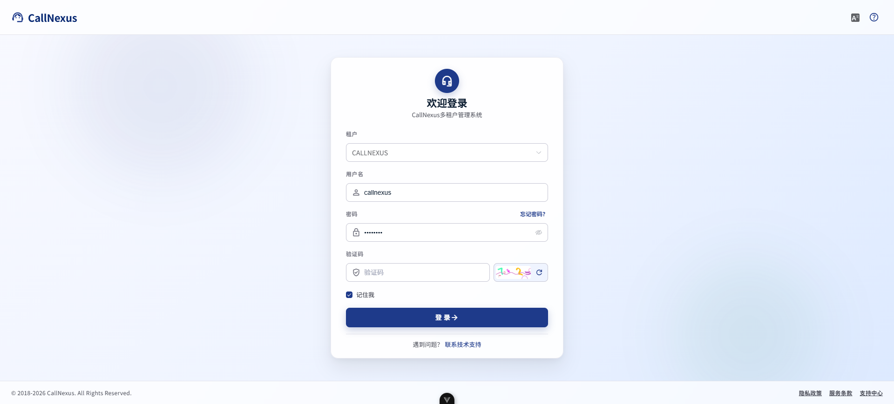
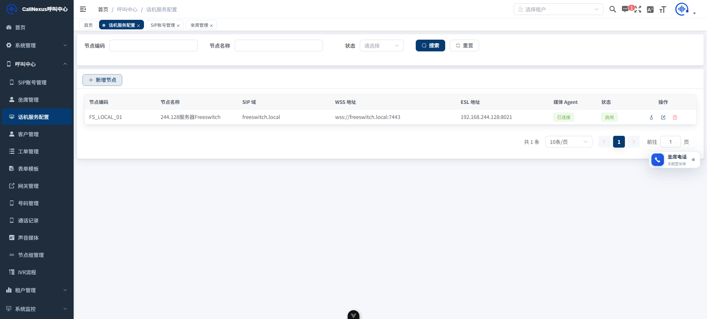
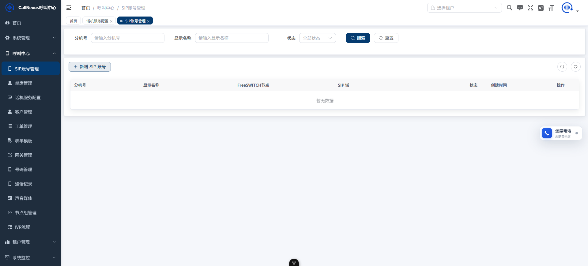
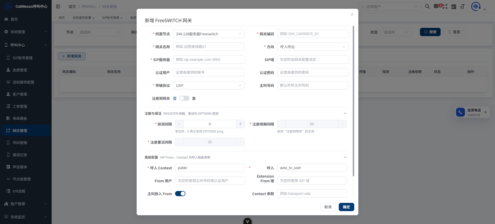
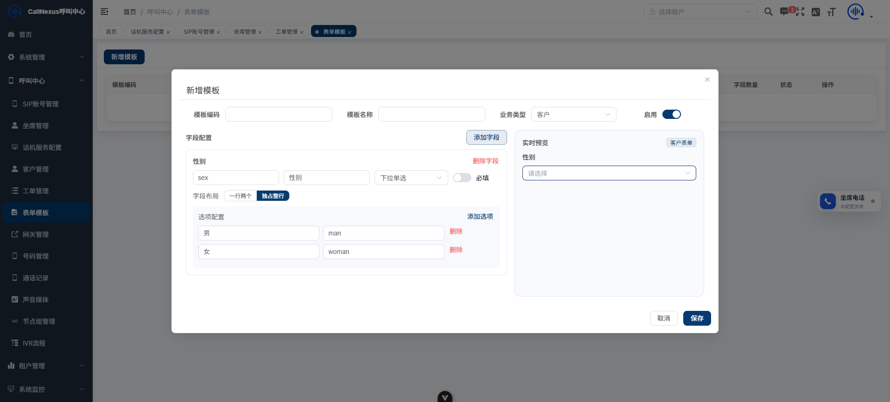
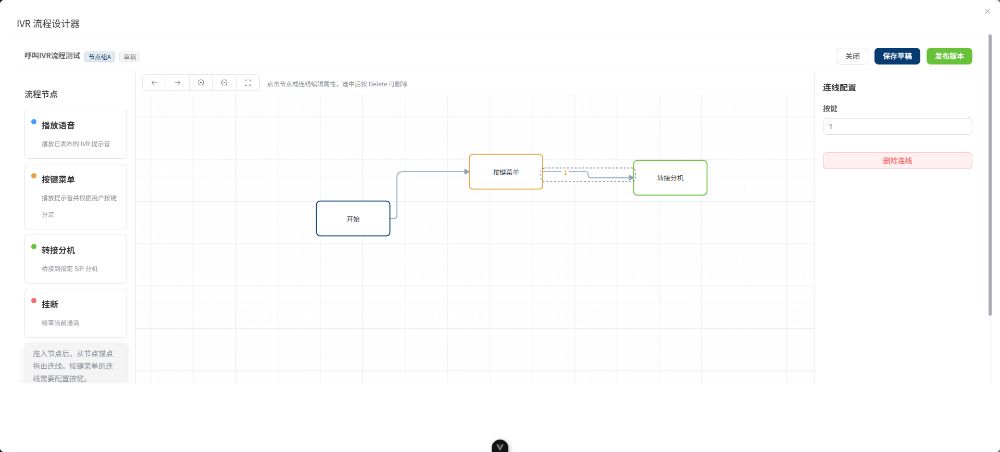

# CallNexus

CallNexus 是一套基于 RuoYi-Vue-Plus 5.6.1 基座、面向多租户的 **呼叫中心管理系统**。后端基于 Spring Boot 3 + Java 17，通过 FreeSWITCH ESL 与动态 XML Curl 接入软交换，前端基于 Vue 3 + Element Plus，已经完成呼叫中心核心底座、动态拨号、外线接入、CDR/录音、声音媒体发布、IVR 拖拽设计器等模块的第一版。

> 配套前端仓库：`CallNexus-UI`
>
> 配套规范文档：`FEATURE_ROADMAP.md`、`DEVELOPMENT_PROGRESS.md`、`AUDIO_STORAGE_DESIGN.md`、`FREESWITCH_MEDIA_AGENT_DEPLOYMENT.md`

---

## 技术栈

| 层 | 选型 |
| --- | --- |
| 语言 / 运行 | Java 17 LTS |
| 框架 | Spring Boot 3.5、Sa-Token、MyBatis-Plus、Redisson、SnailJob、Flyway |
| 数据 | MySQL 8、Redis、MinIO（私有 OSS 桶按声音分类隔离） |
| 软交换 | FreeSWITCH（ESL + `mod_xml_curl` 动态 Directory / Gateway / Dialplan） |
| 前端 | Vue 3 + TypeScript + Vite + Element Plus + LogicFlow（IVR 设计器）+ WaveSurfer（波形播放） |
| 部署辅助 | Docker Sidecar 媒体同步 Agent（FFmpeg 标准化 WAV） |

---

## 模块结构

```text
CallNexus/
├── callnexus-admin                 启动模块（装配各业务模块）
├── callnexus-common                公共能力（Sa-Token / Web / Redis / OSS / 日志 / 加密）
├── callnexus-extend                扩展能力（监控、SMS、第三方等）
├── callnexus-modules/              业务模块
│   ├── callnexus-system              系统管理（基座保留）
│   ├── callnexus-resource            FreeSWITCH 资源（节点 / 节点组 / 网关 / 号码 / SIP / Directory / Dialplan / Gateway XML）
│   ├── callnexus-agent               坐席管理 / 坐席工作台 / 签入签出 / 状态
│   ├── callnexus-esl                 ESL 连接 / 命令网关 / 事件分发 / 通话生命周期
│   ├── callnexus-call                CDR 业务通话 / 通话腿 / 时间线 / 录音管理
│   ├── callnexus-ivr                 IVR 流程 / 不可变发布版本 / 节点编译器 / 媒体校验
│   ├── callnexus-customer            客户 / 工单 / 动态表单模板 / 跟进记录
│   ├── callnexus-outbound            外呼任务（规划中）
│   ├── callnexus-workflow / job / generator / demo  基座沿用
└── script、image、logs              数据库脚本、系统截图、运行日志
```

---

## 系统登录



支持多租户登录、租户切换、记住密码、验证码刷新；登录页基于 Material 风格重构，已适配中文/英文语言切换。

---

## 系统示例图







## 已支持的功能

### 1. 坐席与 SIP 基础能力

- **FreeSWITCH 节点管理**：维护节点 SIP 域、WSS、ESL 地址 / 端口 / 密码、媒体根目录、Agent Token。
- **SIP 账号管理**：账号、密码加密存储、绑定 FreeSWITCH 节点；通过动态 Directory 完成 `mod_xml_curl` 注册联调。
- **坐席管理**：坐席与系统用户、SIP 账号、FreeSWITCH 节点三向绑定，支持签入、签出、示忙、示闲。
- **坐席电话条**：浏览器悬浮软电话支持拖拽、边界限制、当前会话位置记忆；通过 WebSocket 实时事件 + 活动通话快照双重恢复来电与通话状态。
- **呼叫控制**：通过 ESL 命令触发普通 SIP 软电话拨打与挂断；保持、转接、三方、监听等高级操作仍在规划。

### 2. FreeSWITCH 动态 XML（mod_xml_curl）

通过独立 HTTP 接口分发不同 section / purpose，无需手工维护 FreeSWITCH XML 文件：

| 接口 | 用途 | 状态 |
| --- | --- | --- |
| `POST /api/internal/freeswitch/directory/users` | SIP 分机注册 Directory | DONE |
| `POST /api/internal/freeswitch/directory/gateways` | 外线网关 user gateways | DONE |
| `POST /api/internal/freeswitch/dialplan` | 号码呼入 / 内部互拨 / IVR / 外呼 Dialplan | DONE |
| `POST /api/internal/freeswitch/directory`（兼容） | 老入口保留 | DONE |
| ACL XML | 集中维护可信 IP / 网关来源 | PLANNED |

- 已支持 FreeSWITCH 注册时传入 IP 域名场景：先按 `domain + extension` 查询，再按分机号兜底。
- 真实呼入兼容多种字段提取被叫号码（`destination_number`、`Caller-Destination-Number`、`Hunt-Destination-Number`、`variable_*`、`sip_to_user`、`sip_req_user`），并清理 `sip:`、`tel:`、`号码@域名` 格式。
- 关键节点输出中文运行日志（`section`、`purpose`、`domain`、`tenantId`、`destination_number`、响应长度），不打印密码、Token、完整 XML 与客户隐私。

### 3. 网关管理


- 网关 CRUD、独立菜单与权限、租户隔离。
- 动态 Gateway XML 按 FreeSWITCH 期望的 `domain name="all"` + `user gateways` 结构输出。
- 完整字段：SIP Trunk 地址、端口、认证、`expire-seconds`、`retry-seconds`、`ping`、`ping-max`、`ping-min`、From 头、Contact 参数、呼入 Context、呼入 Extension、备注。
- 运行态同步：新增执行 `reloadxml + rescan`；修改执行 `killgw → 等待 → reloadxml → rescan`；删除仅执行 `killgw`，避免被重新拉取。
- `ping=0` 模式针对不响应 SIP OPTIONS 的运营商线路，已通过真实外线呼入验证。

### 4. 号码管理 / 动态 Dialplan

- DID 号码 CRUD、绑定 FreeSWITCH 节点、绑定出局网关、设置默认主叫号码。
- 呼入路由类型：**固定 SIP 分机** / **IVR 流程**（队列、技能组待开发）。
- 路由策略使用 `DialplanRouteHandlerRegistry` 注册机制，新增路由类型只需新增独立 Handler，主分发流程不变。
- 节点 SIP 域无法命中时，可按租户内唯一 DID 兜底匹配，并校验目标节点处于启用状态。

### 5. CDR 业务通话与录音

- 三表模型：`cc_call_session`（业务通话）/ `cc_call_record`（底层通话腿）/ `cc_call_event`（操作时间线）。
- ESL 事件支持 `CHANNEL_CREATE`、振铃、接听、桥接、解除桥接、保持、恢复，并以 `CHANNEL_HANGUP_COMPLETE` / `CHANNEL_HANGUP` / `CHANNEL_DESTROY` 三事件兜底落库。
- 一次外线呼入 + 桥接分机在列表中合并为 **一条** 业务通话；详情提供"基本信息 / 通话录音 / 处理时间线 / 底层通话腿"四个标签页。
- 动态 Dialplan 与 ESL 外呼自动注入 `callnexus_business_call_id`、`callnexus_direction`、原始主被叫号码。
- FreeSWITCH 常见挂断原因已映射为中文说明，保留原始原因码用于排障。
- 客户 / 工单详情提供"通话记录" Tab，优先按显式 `customerId` / `ticketId` 关联，旧数据按号码兜底。

录音：

- FreeSWITCH 自动录音 + 挂断 `api_hangup_hook` 异步上传至独立 `call-recording` MinIO 桶。
- 通话录音同步创建 `CALL_RECORDING` 媒体资产，并写回 `cc_call_session.recording_media_id` 形成稳定关联。
- 播放统一使用 MinIO 预签名直链（默认 2 小时有效），私有桶不暴露永久路径；通话详情接入 **WaveSurfer 波形播放器**，支持进度高亮与拖拽跳转。
- 通用能力 `OssService.selectUrlById(ossId, ttl)` 统一签发，业务侧只决定有效期。

### 6. 声音媒体管理与节点同步

- 统一表 `cc_media_asset`：稳定媒体 ID、声音分类（`CALL_RECORDING` / `RINGBACK_TONE` / `QUEUE_WAIT_MUSIC` / `IVR_PROMPT` / `USER_MUSIC`）、音频参数、引用计数。
- 按声音分类使用独立 OSS 配置键与 MinIO 桶，配置键支持环境变量覆盖。
- **不可变版本**：上传自动创建 `v1` 草稿版本，可继续上传 `v2`、`v3`；发布选定不可变版本，已发布版本永不修改。
- **通用 FreeSWITCH 节点组**（`callnexus-resource/freeswitch-node-group`）：按组发布、取消发布、部分发布、失败重试、节点组新增成员自动补同步。
- **Sidecar 媒体同步 Agent**（Docker 镜像 `callnexus-media-agent`）：使用节点独立 Token 心跳、租约任务、下载源文件、FFmpeg 转 WAV PCM 8kHz/16bit/mono、原子写入 FreeSWITCH 共享卷。
- WaveSurfer 试听、启停、删除保护（已引用 / 已发布禁止删除）。
- 已为 AI 扩展预留：`transcript_status`、`transcript_text`、`summary_text`、`keywords_json`、`sentiment_json`、`ai_metadata_json`、TTS 来源字段。

### 7. IVR 拖拽流程设计器


- 数据模型：`cc_ivr_flow`（草稿）+ 不可变发布版本表，已发布流程不随草稿修改而中断线上呼入。
- 前端基于 **LogicFlow** 实现拖拽设计器，支持锚点连线、折线、缩放、平移、适应画布、撤销 / 重做、选中删除。
- 节点元数据集中到 `IvrFlowDesigner/nodeRegistry.ts`，节点属性由 `propertySchema` 驱动，属性编辑器走注册表。
- 第一版节点：**开始 / 播放语音 / DTMF 按键菜单 / 转接分机 / 挂断**。
- 发布前校验：开始节点唯一、节点可达性、普通节点单出口、DTMF 按键不重复、目标节点合法、播放节点引用的 `IVR_PROMPT` 必须已发布且同步到流程节点组的全部节点。
- 后端 `IvrNodeCompilerRegistry` 同时服务于"发布校验"和"运行时 Dialplan 编译"，新增节点只需实现独立编译器。
- IVR 入口先 answer 并等待 300ms，规避运营商不透传 183 Early Media 时主叫听不到提示音。
- 号码管理新增 `IVR` 呼入路由类型，可绑定已发布 IVR 流程。

### 8. 客户、工单与动态表单


- **客户管理**：创建 / 查询 / 详情；号码已存在时直接带出已有客户，不重复创建；客户详情右侧 Tabs 当前包含 **跟进记录** 与 **通话记录**。
- **工单管理**：创建 / 详情 / 自定义字段展示；工单与业务通话显式关联；状态流转、处理记录、SLA 仍在规划。
- **动态表单模板**：客户与工单共用模板能力，支持输入框、文本框、日期、单选、多选、下拉等字段类型；选项标签与值分离；一行两个字段或独占整行的布局；客户 / 工单详情按模板渲染。

---

## 规划中的功能

| 模块 | 状态 | 说明 |
| --- | --- | --- |
| 技能组 / 队列 | PLANNED | 排队策略（最长空闲 / 轮询 / 随机 / 优先级）、等待音、超时与溢出、实时看板 |
| 外呼任务 | PLANNED | 预览式 → 渐进式 → 预测式 → 机器人外呼；名单 / 批次 / 重试 / 黑名单 |
| 高级呼叫控制 | PLANNED | 保持 / 转接 / 咨询 / 三方 / 监听 / 强插 |
| 知识库 / AI 坐席辅助 | PLANNED | 实时转写、话术推荐、意图识别、字段抽取、工单草稿、通话摘要 |
| FreeSWITCH ACL XML | PLANNED | 集中维护可信 IP / 网关来源 |
| 运营报表 / 监控告警 | PLANNED | 呼入量 / 接通率 / 坐席效率 / 队列堆积 / 网关与 ESL 状态 |

---

## 数据库迁移脚本

数据库变更全部通过 Flyway 维护，关键脚本：

| 版本 | 内容 |
| --- | --- |
| `V13` | CDR 通话记录第一版 |
| `V14` | CDR 业务通话聚合（`cc_call_session` + `cc_call_event`） |
| `V15` | 通话记录显式关联客户 / 工单 / 录音 |
| `V16` | 统一 `cc_media_asset` 媒体资产 |
| `V17` | 通用节点组、媒体不可变版本、发布记录、节点同步任务 |
| `V18` | IVR 流程 + 不可变发布版本 |

部署后需为新模块分配菜单和权限（网关、号码、节点组、声音媒体、IVR 流程等）。

---

## 部署要点

1. 在文件管理中创建并启用声音分类 OSS 配置：`call-recording`、`ringback-tone`、`queue-wait-music`、`ivr-prompt`、`user-music`。
2. 配置 FreeSWITCH `mod_xml_curl`，将 directory / gateways / dialplan 分别指向 `/api/internal/freeswitch/*` 接口，并携带 `token`、`tenantId`、`domain` 参数。
3. 部署录音上传脚本（参考 `FREESWITCH_RECORDING_DEPLOYMENT.md`），确保 FreeSWITCH 容器内存在 `curl`。
4. 部署媒体同步 Sidecar Agent（参考 `FREESWITCH_MEDIA_AGENT_DEPLOYMENT.md`），与 FreeSWITCH 共享声音卷 `/var/lib/freeswitch/sounds/callnexus`。
5. 在 CallNexus 节点页面为每个 FreeSWITCH 节点生成独立 Agent Token，并加入需要发布媒体的节点组。

FreeSWITCH 动态 Directory 默认参数：

```text
CALLNEXUS_FREESWITCH_DIRECTORY_SECRET = cnx_fs_dir_8f3d9c2b7a1e4f6a9c0d5b2e
CALLNEXUS_FREESWITCH_DIRECTORY_TENANT_ID = 000000
```

手动验证示例：

```bash
curl -X POST "http://后端地址/api/internal/freeswitch/directory?token=cnx_fs_dir_8f3d9c2b7a1e4f6a9c0d5b2e&tenantId=000000" \
  -H "Content-Type: application/x-www-form-urlencoded" \
  -d "section=directory&domain=freeswitch.local&user=1003"
```

---

## 许可

本项目继承 RuoYi-Vue-Plus 基座的开源许可，详见 [`LICENSE`](./LICENSE)。
